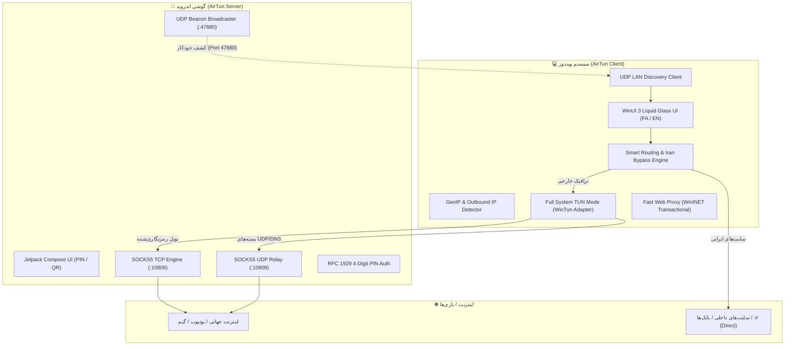

<div align="center">

# ⚡ AirTun (ایر‌تون)
### Ultra-Fast, Low-Latency Phone Internet Sharing for Windows
**اشتراک‌گذاری پرسرعت، پایدار و بدون مرز اینترنت گوشی با ویندوز**

[](#-تست‌ها-و-راستی‌آزمایی)
[](#)
[](LICENSE)
[](https://github.com/leoson95/AirTun)

</div>

---

## 📖 معرفی پروژه (Overview)

**AirTun** یک راهکار مدرن، سبک و با تاخیر نزدیک به صفر برای اشتراک‌گذاری اینترنت و وی‌پی‌ان گوشی‌های اندرویدی با سیستم‌های ویندوزی است. برخلاف روش‌های سنتی هات‌اسپات که توسط اپراتورها مسدود می‌شوند یا پینگ بازی‌ها را به شدت افزایش می‌دهند، AirTun از **یک هسته بومی SOCKS5/UDP Engine در اندروید** و **یک کلاینت قدرتمند با رابط کاربری WinUI 3 در ویندوز** استفاده می‌کند.

---

## ✨ ویژگی‌های برجسته (Key Features)

### 🚀 هسته قدرتمند اندروید (Android SOCKS5 Engine)
- **پشتیبانی کامل از TCP و UDP:** فوروارد مستقیم بسته‌های DNS و پروتکل‌های بلادرنگ (Gaming & Voice).
- **مصرف بهینه منابع:** مصرف رم زیر ۱۵ مگابایت با معماری Non-blocking Kotlin Coroutines.
- **کشف خودکار شبکه (UDP Beacon):** برادکست آنی در شبکه هات‌اسپات/وای‌فای روی پورت `47880`.
- **امنیت بر پایه پین‌کد ۴ رقمی:** رمزنگاری و احراز هویت موقت بر اساس استاندارد RFC 1929.
- **رابط کاربری مدرن شیشه‌ای (Liquid Glass):** شمارنده زنده ترافیک، نمایش پین بزرگ و QR Code برای اتصال سریع.

### 💻 کلاینت مدرن ویندوز (Windows Desktop Client)
- **طراحی زیبا بر پایه WinUI 3 & Windows App SDK:** رابط کاربری مدرن مایکا، پشتیبانی ۱۰۰٪ از زبان‌های **فارسی (RTL)** و **انگلیسی (LTR)** همراه با تم‌های روشن و تیره.
- **حالت‌های دوگانه اتصال (Dual Tunneling Modes):**
  - 🎮 **Full System TUN Mode:** ساخت اینترفیس مجازی WinTun جهت پوشش ۱۰۰٪ ترافیک ویندوز (بازی‌های آنلاین، تلگرام، ابزارهای برنامه‌نویسی `git`, `npm`, `pip`, `docker` و وب).
  - 🌐 **Fast Web Proxy Mode:** تنظیم آنی و سبک پروکسی سیستم برای مرورگرها همراه با قابلیت بازیابی خودکار پس از کرش (Crash Recovery).
- **🇮🇷 کنترل هوشمند روتینگ (Smart Routing & Domestic Bypass):**
  - کلید دایرکت کردن سایت‌های داخلی: دامنه‌های `.ir`، درگاه‌های بانکی شاپرک و سامانه‌های ملی بدون عبور از تونل باز می‌شوند تا اتصال بانکی قطع نشود و حجم مصرف نگردد.
  - **موتور قوانین سفارشی (Custom Rules Engine):** تعریف بی‌نهایت قانون بر اساس دامنه یا کلمه کلیدی به سبک Geosite / V2Ray با رفتارهای Direct, Proxy, Block.
- **🌍 تشخیص خودکار آی‌پی و کشور خروجی (GeoIP & Outbound IP):**
  - استعلام لحظه‌ای آی‌پی پابلیک، پرچم ایموجی و نام کشور متصل (مانند `🇩🇪 Germany` یا `🇫🇮 Finland`) و نام ISP / دیتاسنتر.
- **📊 مانیتورینگ زنده ترافیک و سرعت:** نمایش سرعت لحظه‌ای آپلود/دانلود، حجم کل مصرفی، پینگ به گوشی و زمان اتصال.
- **سیستم تری (System Tray):** اجرای روان در پس‌زمینه و خروج ایمن (Safe Teardown).

---

## 🏗️ معماری سیستم (Architecture)



---

## 🚀 راهنمای راه‌اندازی و اجرا (Quick Start)

### ۱. اجرای نسخه اندروید:
1. فایل `AirTun.apk` را روی گوشی نصب کنید.
2. هات‌اسپات گوشی را روشن کنید.
3. برنامه AirTun را باز کرده و دکمه **شروع (Start)** را لمس کنید. پین‌کد ۴ رقمی روی صفحه ظاهر می‌شود.

### ۲. اجرای نسخه ویندوز:
1. لپ‌تاپ/کامپیوتر را به هات‌اسپات گوشی وصل کنید.
2. فایل `AirTun.App.exe` را اجرا کنید.
3. گوشی شما به صورت خودکار در لیست دستگاه‌ها ظاهر می‌شود. روی آن کلیک کنید، پین‌کد ۴ رقمی را وارد کرده و دکمه **اتصال (Connect)** را بزنید.

---

## 🧪 تست‌ها و راستی‌آزمایی (Tests & Quality Assurance)

پروژه دارای پوشش تست خودکار روی هر دو پلتفرم است:

```bash
# اجرای تست‌های واحد ویندوز (36 تست پاس‌شده)
dotnet test windows/AirTun.sln

# اجرای بیلد کامل ویندوز (0 Warning, 0 Error)
dotnet build windows/AirTun.sln

# اجرای تست‌های واحد اندروید (24 تست پاس‌شده)
cd android
./gradlew testDebugUnitTest
```

---

## 📂 ساختار ریپازیتوری (Repository Structure)

```
AirTun/
├── android/                   # اپلیکیشن و سرور اندروید (Kotlin + Compose + Gradle)
│   └── app/src/main/kotlin/io/airtun/app/
│       ├── socks5/            # موتور بومی SOCKS5 TCP & UDP Relay
│       ├── beacon/            # برودکستر UDP Beacon کشف خودکار
│       └── ui/                # رابط کاربری شیشه‌ای Compose
├── windows/                   # کلاینت ویندوز (C# .NET 8 + WinUI 3)
│   ├── AirTun.Core/           # کتابخانه شبکه، کشف، پین، روتینگ و GeoIP
│   │   ├── Routing/           # موتور روتینگ و قوانین دایرکت ایران
│   │   ├── Geo/               # سرویس استعلام آی‌پی و لوکیشن
│   │   ├── Proxy/             # موتور ترنزکشنال پروکسی ویندوز
│   │   └── Tunnel/            # اینترفیس کارت شبکه مجازی WinTun
│   ├── AirTun.App/            # اپلیکیشن مدرن WinUI 3
│   │   ├── Styles/Tokens.xaml # توکن‌های رنگی و استایل Liquid Glass
│   │   └── Strings.cs         # ترجمه‌های کامل فارسی و انگلیسی
│   └── AirTun.App.Tests/      # ۳۶ تست واحد xUnit
└── windows/publish/           # خروجی نهایی آماده اجرای ویندوز (Win-x64)
```

---

## 📄 لایسنس (License)

این پروژه تحت مجوز **MIT License** منتشر شده است.
گیت‌هاب رسمی: [https://github.com/leoson95/AirTun](https://github.com/leoson95/AirTun)
